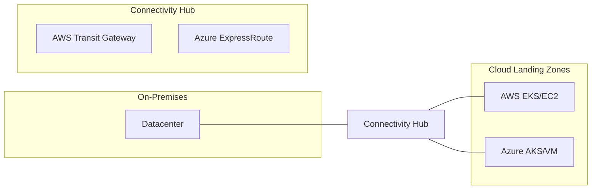
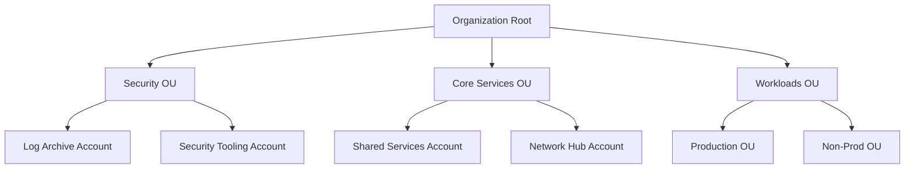
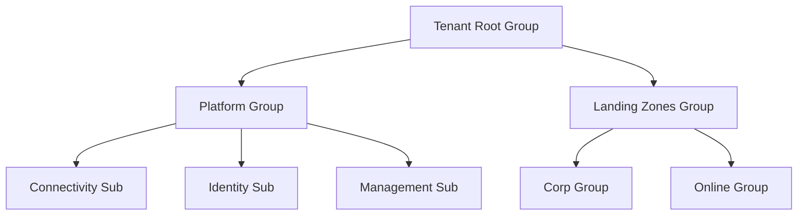

# 🏰 Hybrid Landing Zone Platform

[](https://github.com/devopstrio/hybrid-landingzone)
[](https://www.terraform.io/)
[](https://www.openpolicyagent.org/)
[](https://opensource.org/licenses/MIT)

> **The ultimate enterprise-grade foundation for multi-cloud governance, automated account provisioning, and zero-trust security orchestration.**

---

## 🏛️ Executive Summary

In the modern enterprise, the "Landing Zone" is the critical foundation upon which all digital transformation is built. As organizations expand across multiple public clouds and maintain massive on-premises estates, the lack of a unified governance model leads to security fragmentation, cost overruns, and operational paralysis.

**Hybrid Landing Zone Platform** is a flagship solution designed to provide a secure, scalable, and governed entry point for all enterprise workloads. It automates the creation of accounts, subscriptions, and projects while enforcing a rigid security baseline and compliance guardrails across AWS, Azure, GCP, and VMware.

### 🎯 Why Landing Zones Matter

1.  **Security at Scale**: Enforce SCPs, Management Group policies, and OPA guardrails before the first workload is deployed.
2.  **Operational Excellence**: Reduce account provisioning time from weeks to minutes via the "Account Factory."
3.  **Cost Transparency**: Centralize billing and enforce tagging standards for accurate FinOps reporting.
4.  **Network Governance**: Standardize on hub-spoke topologies with built-in inspection and zero-trust boundaries.

---

## 🏗️ Architecture Overview

The platform operates as a centralized "Control Plane" that orchestrates the "Landing Zone" lifecycle across all target environments.

### 1. Executive Architecture
*The central orchestration of multi-cloud foundations.*

```mermaid
graph TD
    subgraph "Control Plane (Hybrid LZ Platform)"
        API[Governance API]
        Web[Management Portal]
        Engine[Provisioning Engine]
        Policy[Policy as Code (OPA)]
        DB[(PostgreSQL)]
    end

    subgraph "Public Cloud foundations"
        AWS[AWS Organizations]
        AZ[Azure Management Groups]
        GCP[GCP Folders]
    end

    subgraph "Shared Services"
        IAM[Identity Hub]
        Log[Logging Hub]
        Net[Network Hub]
    end

    Web --> API
    API --> Engine
    Engine --> Policy
    Engine --> AWS
    Engine --> AZ
    Engine --> GCP
    AWS --> SharedServices[Shared Services]
    AZ --> SharedServices
    GCP --> SharedServices
```

### 2. Hybrid Landing Zone Topology
*Connecting On-Premises datacenters with multi-cloud foundations.*



---

## 🚀 Platform Capabilities

### 🏭 Account Factory
- **One-Click Provisioning**: Automated workflows for AWS Accounts, Azure Subscriptions, and GCP Projects.
- **Vending Machine Patterns**: Pre-configured templates for Sandbox, Development, and Production environments.
- **Metadata Management**: Centralized tracking of owners, cost centers, and compliance levels.

### 🛡️ Governance & Policy as Code
- **Guardrail Enforcement**: OPA-based validation of infrastructure before deployment.
- **Tagging Governance**: Automated remediation of resources missing mandatory tags.
- **Compliance Reporting**: Real-time dashboards showing the security posture of the entire cloud estate.

### 🌐 Hybrid Networking
- **Hub-Spoke Standard**: Automatic deployment of central hubs with transit connectivity.
- **DNS Orchestration**: Unified private DNS resolution across all clouds and on-premises.
- **Traffic Inspection**: Centralized firewalls and WAFs for all ingress/egress points.

---

### 11. AWS Organizations Model
*Hierarchical governance of AWS accounts.*



### 12. Azure Management Groups
*Policy inheritance and management at scale.*



---

## 🛠️ Deployment Guide

### Prerequisites
- Docker & Docker Compose
- Node.js 18+
- Python 3.11+
- Terraform 1.4+
- Cloud Provider Credentials (Org Admin)

### Local Setup
1.  **Clone the repository**:
    ```bash
    git clone https://github.com/devopstrio/hybrid-landingzone.git
    cd hybrid-landingzone
    ```
2.  **Start Services**:
    ```bash
    make up
    ```
3.  **Access Portal**:
    Open `http://localhost:3000`

---

## 📋 Roadmap

- [ ] **Q3 2026**: Integration with VMware Cloud on AWS / Azure VMware Solution.
- [ ] **Q4 2026**: AI-driven cost anomaly detection and auto-remediation.
- [ ] **Q1 2027**: Sovereign Cloud landing zone templates for EU/Regulated markets.

---

## 📜 License
Distributed under the MIT License. See `LICENSE` for more information.
