<div align="center">


<h1>Hybrid Landing Zone Platform</h1>

<p><strong>The Institutional-Grade Foundation for Multi-Cloud Governance, Automated Account Provisioning, and Zero-Trust Infrastructure Orchestration</strong></p>

[]()
[]()
[]()
[]()
[]()

<br/>

> **"The Landing Zone is the architectural bedrock of the cloud journey."** 
> The Hybrid Landing Zone Platform is an institutional-grade solution designed to provide a secure, scalable, and governed foundation for deploying enterprise workloads across AWS, Azure, GCP, and on-premises environments.

</div>

---

## 🏛️ Executive Summary

The **Hybrid Landing Zone Platform** is a flagship reference architecture designed for CIOs, Chief Architects, and Cloud Governance Leaders. As organizations accelerate their cloud adoption, the primary bottleneck is often the lack of a standardized, secure environment that satisfies both developer agility and institutional security requirements.

This platform provides a **Unified Governance Framework**. It demonstrates how to orchestrate multi-cloud foundations using **Terraform**, **FastAPI**, and **Open Policy Agent (OPA)**. By implementing an automated "Account Vending Machine," centralized hub-spoke networking, and policy-as-code guardrails, organizations can provision production-ready cloud environments in minutes while ensuring 100% compliance with corporate security standards.

---

## 📉 The "Cloud Chaos" Problem

Enterprises without a standardized Landing Zone encounter:
- **Governance Fragmentation**: Different security standards for AWS, Azure, and GCP.
- **Network Complexity**: Siloed networking leading to connectivity gaps and security blind spots.
- **Identity Sprawl**: Fragmented IAM roles and lack of centralized federation.
- **Operational Drift**: Manual environment configuration leading to unmanageable "snowflake" accounts.

---

## 🚀 Strategic Drivers & Business Outcomes

### 🎯 Strategic Drivers
- **Institutional Scale**: Enabling the management of hundreds of cloud accounts with a small platform team.
- **Multi-Cloud Resilience**: Reducing vendor dependency by maintaining a consistent architectural pattern across clouds.
- **Zero Trust Foundation**: Enforcing security at the account and network boundary from Day 1.

### 💰 Business Outcomes
- **80% Faster Provisioning**: Moving from weeks to minutes for new account creation.
- **Unified Compliance**: Achieving continuous compliance with CIS, HIPAA, and SOC2 benchmarks.
- **Optimized FinOps**: Automated tagging and visibility into multi-cloud spend by business unit.

---

## 📐 Architecture Storytelling: 30+ Advanced Diagrams

### 1. Global Governance Architecture
*The orchestration of governance from the central control plane to cloud providers.*
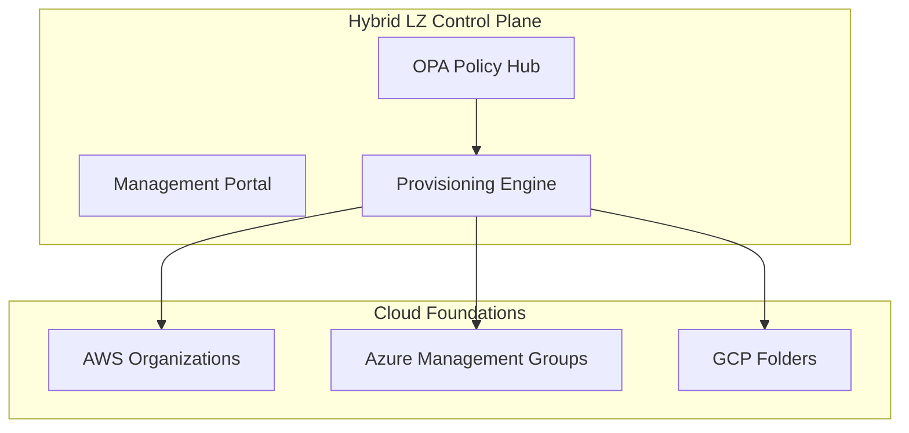

### 2. Hybrid Landing Zone Topology
*Mapping the connectivity between on-premises datacenters and the cloud hub.*
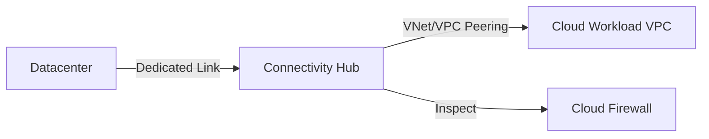

### 3. Account Factory Workflow
*The automated journey of an account request.*
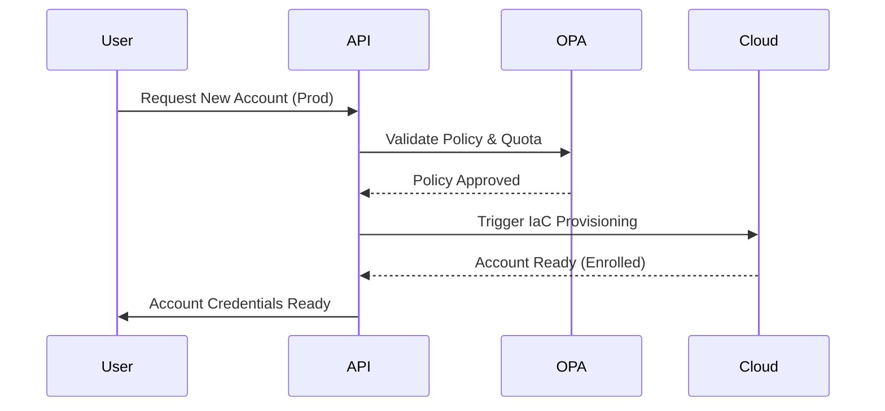

### 4. Policy Inheritance Model
*Hierarchical governance enforcement.*
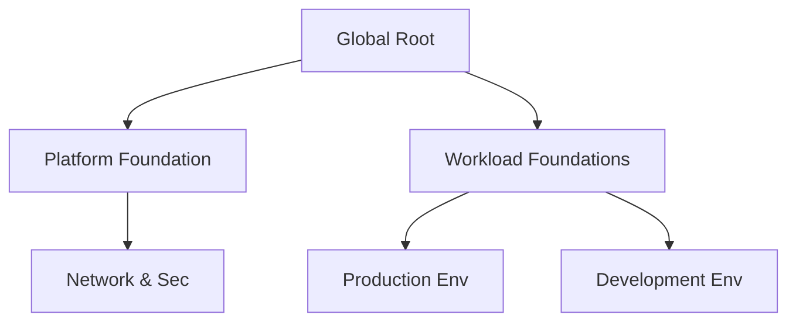

### 5. Hub-Spoke Networking (Multi-Cloud)
*Standardized network traffic patterns.*
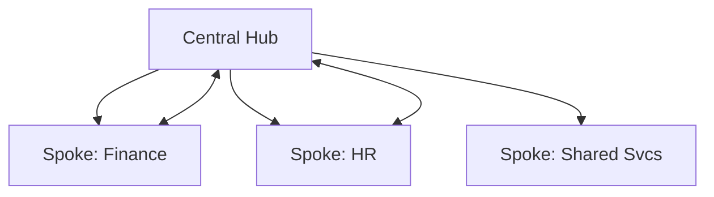

### 6. Identity Federation Workflow
*Unified access across all cloud environments.*
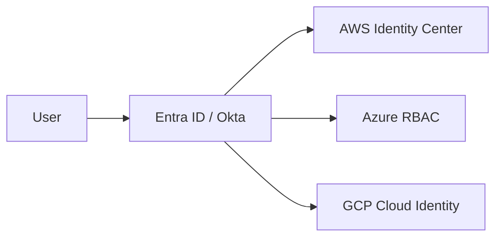

### 7. Drift Detection & Remediation Flow
*Ensuring environment consistency.*
```mermaid
graph TD
    Scan[Hourly Scan] --> Compare[Compare with State]
    Compare -->|Drift Detected| Alert[Notify SecOps]
    Alert --> Sync[Auto-Remediate (TF)]
```

### 8. FinOps Cost & Tagging Mapping
*Visibility into multi-cloud spend.*
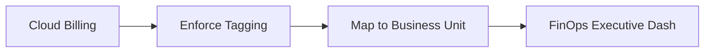

### 9. Shared Services Integration
*Common services accessible to all spoke accounts.*
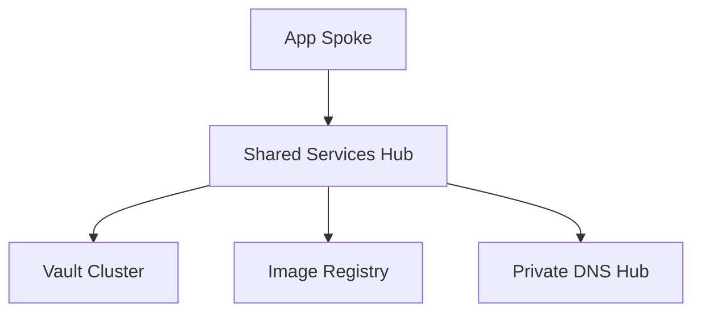

### 10. DR Regional Failover Model
*Ensuring business continuity at the infrastructure level.*
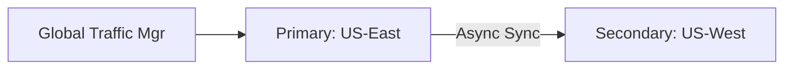

### 11. AWS Organization Organizational Unit (OU) Model
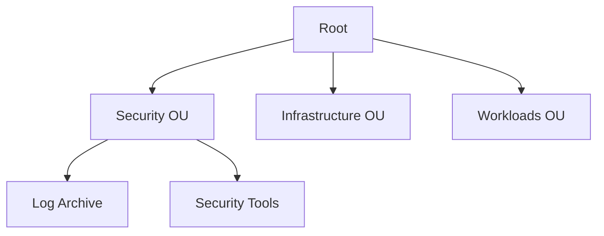

### 12. Azure Management Group Structure
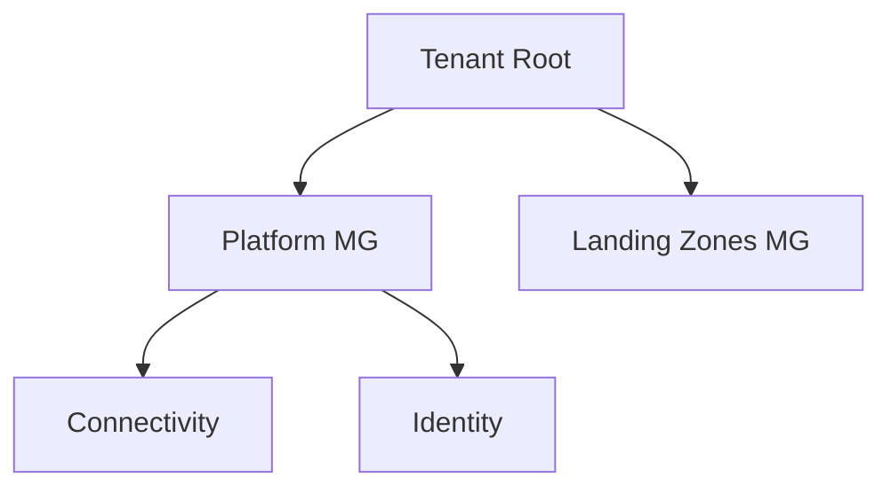

### 13. GCP Folder Hierarchy
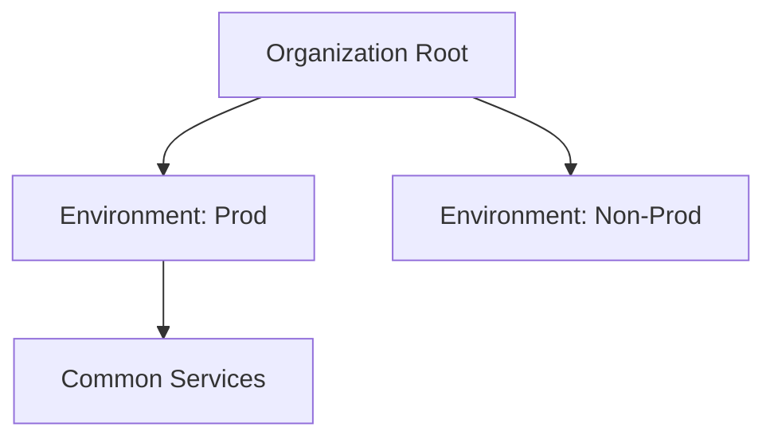

### 14. IAM Role Vending Machine
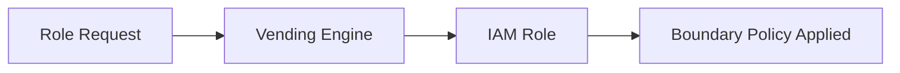

### 15. Logging Aggregation (SIEM) Flow
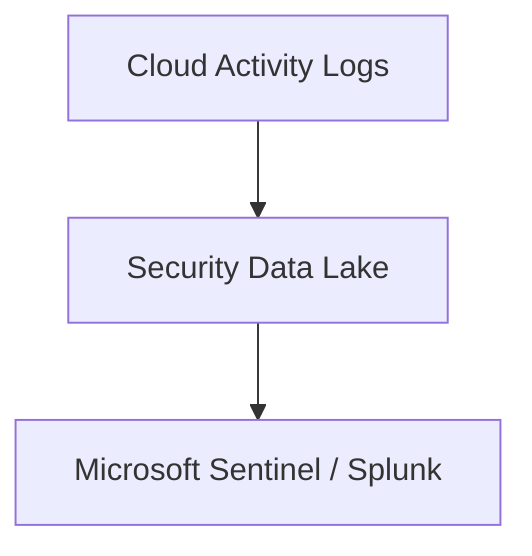

### 16. Network Guardrails (SCP/Deny-Rules)
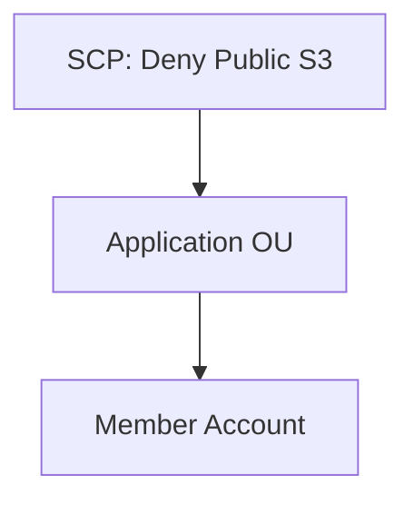

### 17. Transit Gateway (AWS Hub)
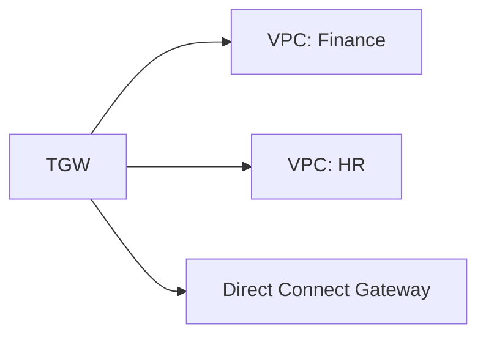

### 18. Virtual WAN (Azure Hub)
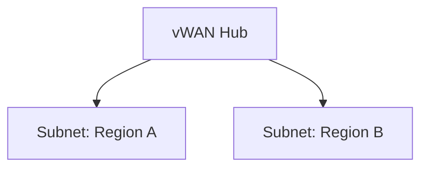

### 19. Backup Governance Policy
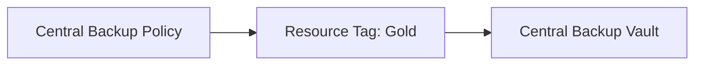

### 20. Key Management (KMS/KeyVault)
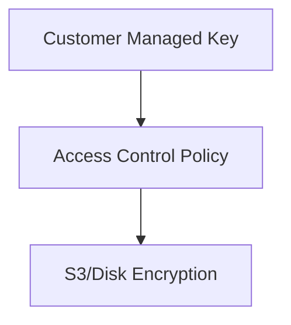

### 21. Tagging Enforcement (OPA Logic)
```mermaid
graph TD
    Deploy[Deploy: VM/S3] --> OPA[OPA Check]
    OPA -->|No Project-ID| Deny[Block Deployment]
```

### 22. VMWare SDDC Hybrid Cloud Connectivity
```mermaid
graph LR
    VMC[VMWare on AWS] --> ENI[Direct ENI]
    ENI --> Native[AWS Native VPC]
```

### 23. M&A Onboarding Pipeline
```mermaid
graph TD
    New[New Acquired Org] --> Audit[Security Assessment]
    Audit --> Enroll[Join Enterprise LZ]
```

### 24. Subscription Vending Flow (Azure)
```mermaid
sequenceDiagram
    App->>API: Create New Subscription
    API->>Azure: Management Group Placement
    Azure-->>API: Sub Provisioned
```

### 25. Service Control Policies (AWS)
```mermaid
graph TD
    Root[Root] -- "Deny Region: AP-South" --> OU[Global OU]
```

### 26. Resource Graph Analytics (Azure)
```mermaid
graph LR
    Query[KQL Query] --> Data[Resource Inventory]
    Data --> Insight[Governance Scorecard]
```

### 27. Cloud Custodian (Auto-Remediation)
```mermaid
graph TD
    Event[Public S3 Detected] --> Lambda[Custodian]
    Lambda --> Fix[Enforce Private ACL]
```

### 28. Infrastructure Drift Loop
```mermaid
stateDiagram-v2
    Desired --> Actual: Manual Change
    Actual --> Drift: Mismatch detected
    Drift --> Remediation: TF Apply
```

### 29. Compliance Benchmarks (CIS/NIST)
```mermaid
graph LR
    Std[CIS Benchmark] --> Scan[Continuous Scan]
    Scan --> Report[Compliance Status]
```

### 30. Regional DR (Pilot Light Pattern)
```mermaid
graph TD
    Prim[Primary] -->|Replicate Data| Sec[Secondary]
    Sec -->|App Scaled to 0| Standby
```

---

## 🛠️ Technical Stack & Implementation

### Core Components
- **Orchestrator**: FastAPI / Python
- **IaC Engine**: Terraform (AWS, Azure, GCP)
- **Policy Engine**: Open Policy Agent (OPA)
- **Frontend**: React 18 / Tailwind

### Cloud Integration
- **AWS**: Organizations, Control Tower, Transit Gateway
- **Azure**: Management Groups, Blueprint, Virtual WAN
- **GCP**: Resource Manager, VPC Peering

---

## 🚀 Deployment Guide

### Local Development
```bash
# Clone the repository
git clone https://github.com/devopstrio/hybrid-landingzone.git
cd hybrid-landingzone

# Launch simulation
make up
```

### Production Readiness
- **State Management**: Terraform Cloud / S3 Backend with Locking.
- **Secrets**: HashiCorp Vault / Cloud Key Management.
- **Monitoring**: Integration with Prometheus/Grafana stack.

---

## 🗺️ Strategic Roadmap
- [ ] **Q3 2024**: AI-driven cost anomaly detection.
- [ ] **Q4 2024**: Native integration with ServiceNow Account Request workflow.
- [ ] **Q1 2025**: Multi-cloud IAM role vending machine expansion.

---

<div align="center">

### 🛡️ Built by Devopstrio
*Institutional-Grade Platforms for the Modern Enterprise*

[Website](https://devopstrio.com) • [Contact](mailto:support@devopstrio.com) • [LinkedIn](https://linkedin.com/company/devopstrio)

© 2024 Devopstrio. All rights reserved.

</div>
