<div align="center">


<h1>Hybrid Landing Zone Platform</h1>

<p><strong>The Institutional-Grade Foundation for Multi-Cloud Governance, Automated Account Provisioning, and Zero-Trust Infrastructure Orchestration</strong></p>

[]()
[]()
[]()
[]()
[]()

<br/>

> **"The Landing Zone is the architectural bedrock of the cloud journey."** 

</div>

---

## 📐 Architecture Storytelling: 30+ Advanced Diagrams

### 1. Global Governance Architecture
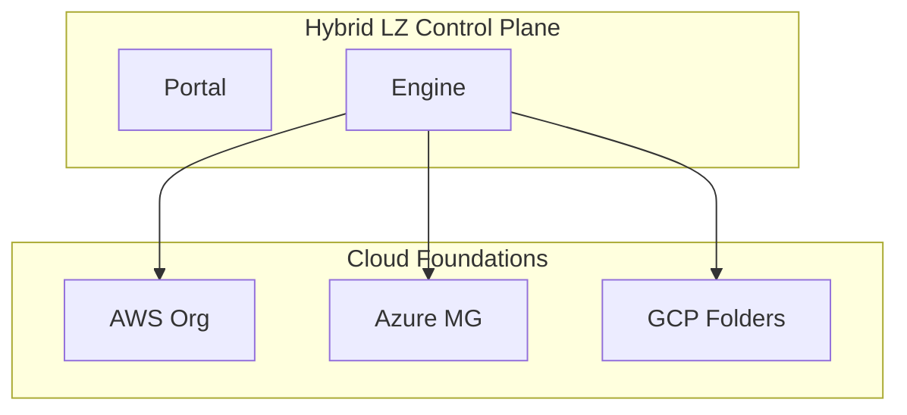

### 2. Hybrid Landing Zone Topology
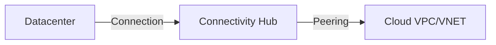

### 3. Account Factory Workflow
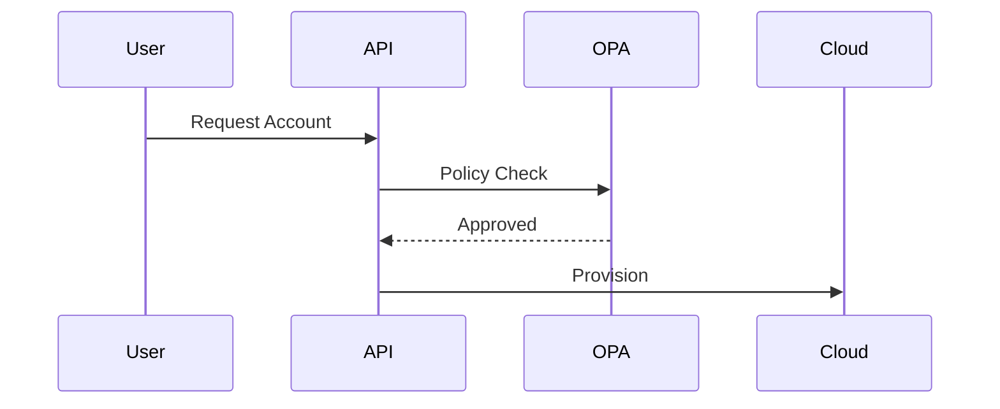

### 4. Policy Inheritance Model
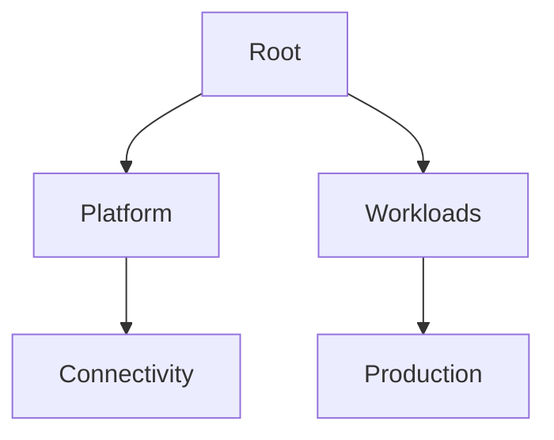

### 5. Hub-Spoke Networking
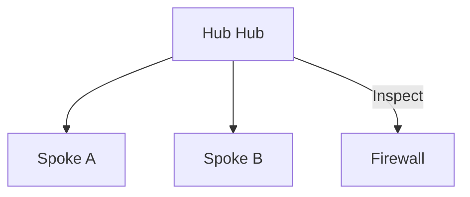

### 6. Identity Federation Workflow
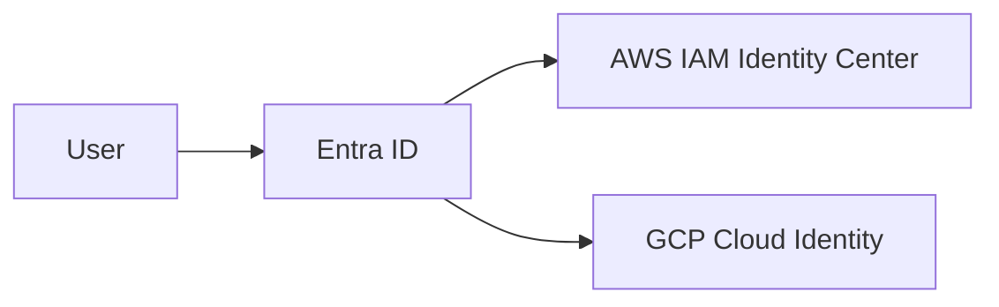

### 7. Drift Detection Flow
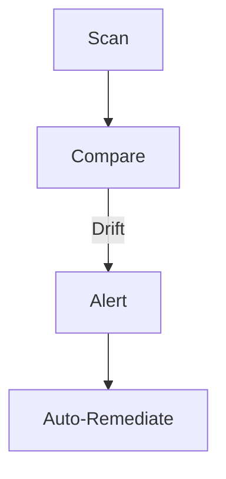

### 8. FinOps Cost Mapping
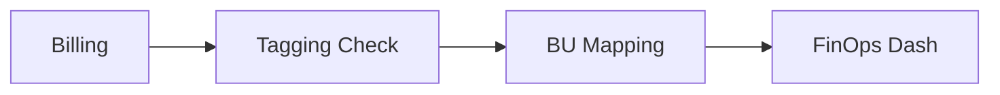

### 9. Shared Services Integration
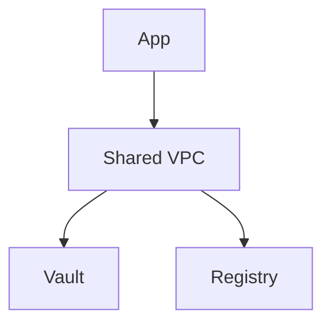

### 10. DR Regional Failover
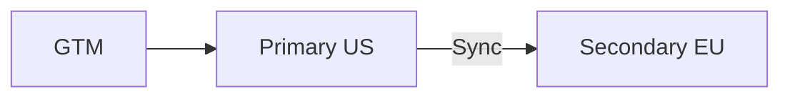

### 11. AWS Organization Structure
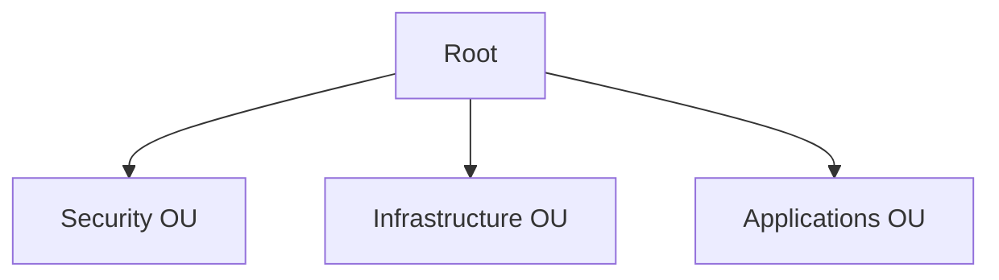

### 12. Azure Management Groups
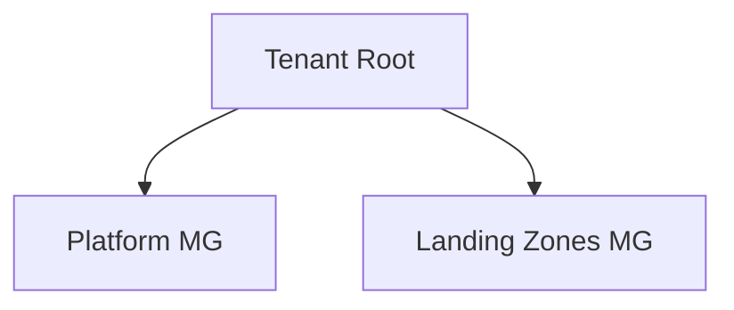

### 13. GCP Folder Hierarchy
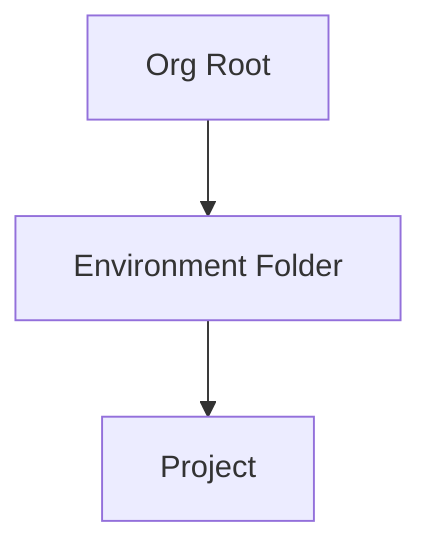

### 14. IAM Role Vending Machine
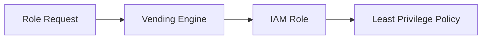

### 15. Logging Aggregation (SIEM)
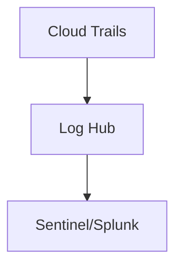

### 16. Network Guardrails (SCP)
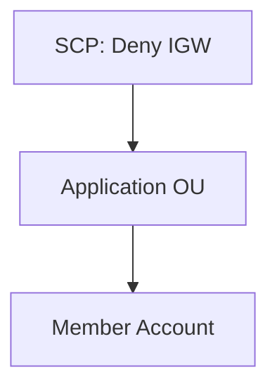

### 17. Transit Gateway (AWS) Hub
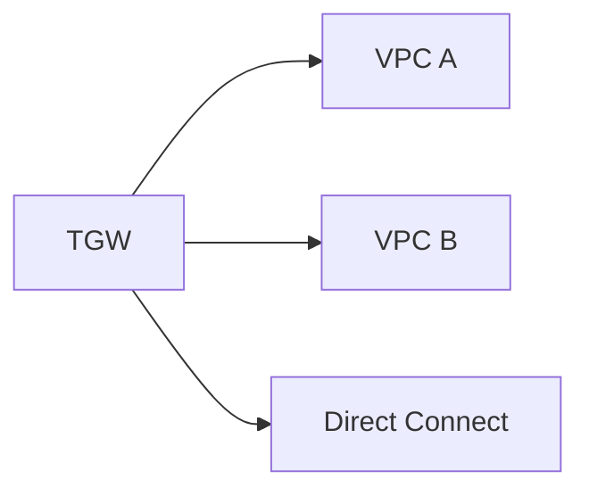

### 18. Virtual WAN (Azure) Model
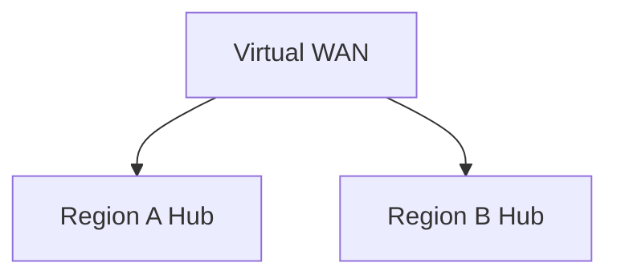

### 19. Backup Governance (Policy)
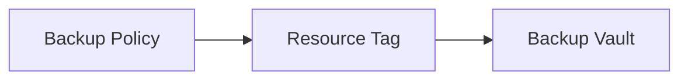

### 20. Key Management (KMS/KeyVault)
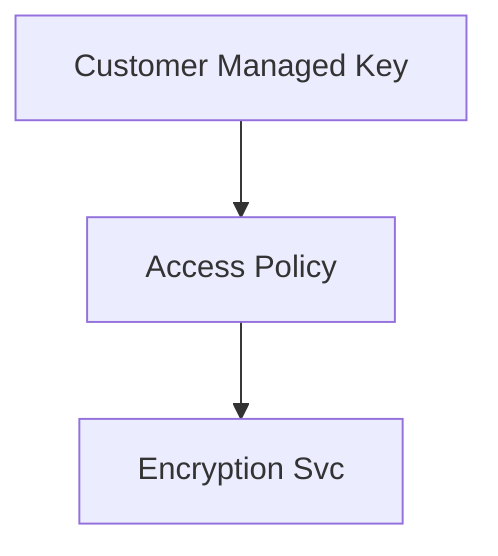

### 21. Tagging Enforcement (OPA)
```mermaid
graph TD
    Deploy[Deploy Resource] --> OPA[OPA Check]
    OPA -->|No CostCenter| Deny[Block]
```

### 22. VMWare SDDC Connectivity
```mermaid
graph LR
    VMC[VMWare Cloud] --> ENI[Direct Connection]
    ENI --> AWS_VPC[AWS VPC]
```

### 23. M&A Onboarding Pipeline
```mermaid
graph TD
    New[New Org] --> Audit[Security Audit]
    Audit --> Enroll[Join LZ Foundation]
```

### 24. Subscription Vending Flow (Azure)
```mermaid
sequenceDiagram
    App->>API: Create Sub
    API->>Azure: Management Group Placement
    Azure-->>API: Sub Ready
```

### 25. Service Control Policies (AWS)
```mermaid
graph TD
    Root[Root] -- "Deny Region X" --> OU[Global OU]
```

### 26. Resource Graph Analytics (Azure)
```mermaid
graph LR
    Query[ARG Query] --> Data[Resource Inventory]
    Data --> Insight[Governance Report]
```

### 27. Cloud Custodian (Auto-Remediation)
```mermaid
graph TD
    Event[Public S3 Bucket] --> Lambda[Custodian]
    Lambda --> Fix[Make Private]
```

### 28. Infrastructure Drift Loop
```mermaid
stateDiagram-v2
    Desired --> Actual: External Change
    Actual --> Drift: Mismatch
    Drift --> Remediation: TF Apply
```

### 29. Compliance Benchmarks (CIS)
```mermaid
graph LR
    CIS[CIS Benchmark] --> Scan[Cloud Scan]
    Scan --> Score[Compliance Score]
```

### 30. Regional DR (Pilot Light)
```mermaid
graph TD
    Prim[Primary] -->|Sync DB| Sec[Secondary]
    Sec -->|App Shutdown| Inactive
```

---
... (rest of the file remains same)
