<div align="center">


<h1>Hybrid Landing Zone</h1>

<p><strong>The Institutional-Grade Platform for Multi-Cloud Connectivity, Hybrid Governance, and Secure Edge Orchestration.</strong></p>

[]()
[]()
[]()

<br/>

> **"The Landing Zone is the architectural bedrock of the hybrid journey."** 
> **Hybrid Landing Zone** is an enterprise-grade platform designed to provide a secure, measurable, and highly automated foundation for global hybrid operations. It orchestrates the complex lifecycle of connectivity—from multi-cloud circuit provisioning and SD-WAN integration to distributed traffic engineering and unified hybrid auditing.

</div>

---

## 🏛️ Executive Summary

Fragmented network silos and manual connectivity provisioning are strategic operational liabilities; lack of centralized hybrid orchestration is a primary barrier to organizational cloud-native maturity. Organizations fail to maintain a secure hybrid foundation not because of a lack of circuits, but because of fragmented landing zone standards, lack of automated traffic validation, and an inability to orchestrate connectivity landing zones with operational precision.

This platform provides the **Hybrid Connectivity Intelligence Plane**. It implements a complete **Enterprise Hybrid-Landing-Zone-as-Code Framework**, enabling Network and Platform teams to manage global hybrid foundations as first-class citizens. By automating the identification of performance bottlenecks through real-time telemetry analysis and orchestrating the provisioning of secure cross-cloud transit hubs, we ensure that every organizational workload—from core datacenter apps to distributed edge services—is connected by default, audited for history, and strictly aligned with institutional hybrid frameworks.

---

## 📐 Architecture Storytelling: Principal Reference Models

### 1. Principal Architecture: Global Hybrid Landing Zone & Connectivity Intelligence Plane
This diagram illustrates the end-to-end flow from multi-cloud circuit ingestion and transit hub orchestration to secure edge integration, traffic engineering, and institutional hybrid auditing.

```mermaid
graph LR
    %% Subgraph Definitions
    subgraph ConnectivityIngress["Hybrid & Edge Ingress"]
        direction TB
        Datacenter_Circuits["Direct Connect / ExpressRoute / Interconnect"]
        Edge_Sites["SD-WAN / SASE / Branch Sites"]
        Public_Ingress["Managed VPN & Internet Gateways"]
    end

    subgraph IntelligenceEngine["Connectivity Intelligence Hub"]
        direction TB
        API["FastAPI Connectivity Gateway"]
        TransitOrch["Cross-Cloud Transit Hub Orch"]
        TrafficEng_Hub["Traffic Engineering & QoS Hub"]
        PerformanceHub["Performance & Latency Hub"]
    end

    subgraph OperationsPlane["Distributed Hybrid Fleet"]
        direction TB
        TransitGateways["AWS TGW / Azure vWAN / GCP Cloud Router"]
        EdgeGateways["Secure Edge & SD-WAN Controllers"]
        TrafficProxies["Layer 7 Traffic Engineering Proxies"]
    end

    subgraph OperationsHub["Institutional Hybrid Hub"]
        direction TB
        Scorecard["Hybrid Maturity Scorecard"]
        Analytics["Latency & Throughput Stats"]
        Audit["Forensic Hybrid Metadata Lake"]
    end

    subgraph DevOps["Hybrid-LZ-as-Code Framework"]
        direction TB
        TF["Terraform Connectivity Modules"]
        DriftBot["Route & Config Drift Validator"]
        ChatOps["Network Operations Hub"]
    end

    %% Flow Arrows
    ConnectivityIngress -->|1. Submit Connectivity Request| API
    API -->|2. Orchestrate Transit| TransitOrch
    TransitOrch -->|3. Apply Traffic Policy| TrafficEng_Hub
    TrafficEng_Hub -->|4. Assess Performance| PerformanceHub
    
    PerformanceHub -->|5. Execute Provision| OperationsPlane
    OperationsPlane -->|6. Notify Status| ChatOps
    API -->|7. Visualize Health| Scorecard
    
    Scorecard -->|8. Track Maturity| Analytics
    Scorecard -->|9. Record Provision| Audit
    
    TF -->|10. Provision Backbone| IntelligenceEngine
    DriftBot -->|11. Inject Config Risk| TransitOrch
    Audit -->|12. Improve Connectivity| TransitGateways

    %% Styling
    classDef ingress fill:#f5f5f5,stroke:#616161,stroke-width:2px;
    classDef intel fill:#e8eaf6,stroke:#1a237e,stroke-width:2px;
    classDef operations fill:#e1f5fe,stroke:#01579b,stroke-width:2px;
    classDef ops fill:#ede7f6,stroke:#311b92,stroke-width:2px;
    classDef devops fill:#e8f5e9,stroke:#1b5e20,stroke-width:2px;

    class ConnectivityIngress ingress;
    class IntelligenceEngine intel;
    class OperationsPlane operations;
    class OperationsHub ops;
    class DevOps devops;
```

### 2. The Hybrid LZ Lifecycle Flow
The continuous path of a hybrid landing zone from initial provision (on-prem) and connection (circuit) to active Zero-Trust security, orchestration (cloud), and institutional forensic auditing.

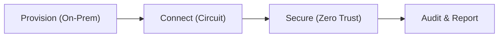

### 3. Distributed Hybrid Landing Zone Topology
Strategically orchestrating connectivity between core datacenters, edge locations, and multi-cloud regions, providing a unified institutional view of global hybrid health and LZ readiness.

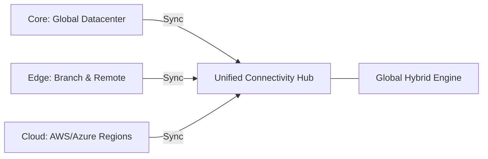

### 4. Cross-Cloud Connectivity & Transit Hub Flow
Executing complex logic for securing the bridge between AWS Transit Gateway, Azure vWAN, and GCP Cloud Router, ensuring every organizational workload is connected and verified against institutional standards.

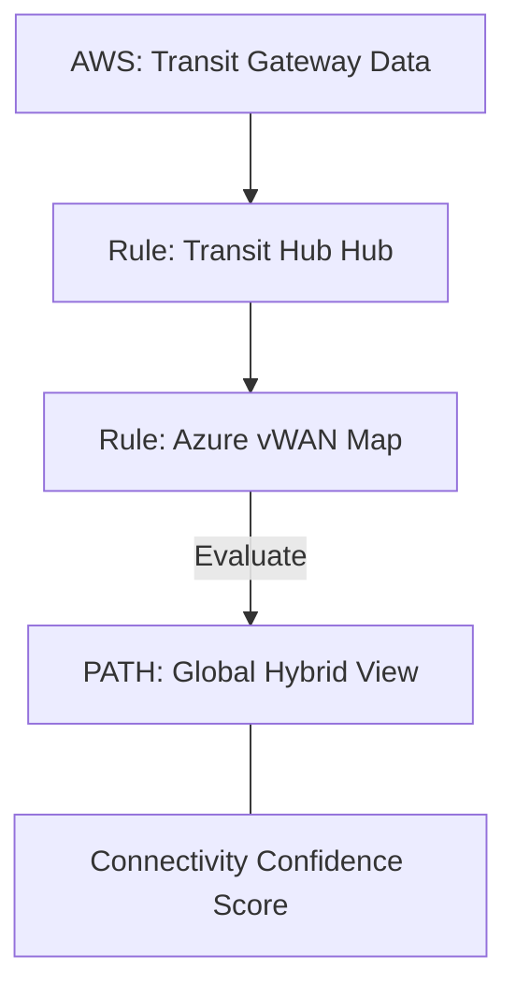

### 5. Secure Edge & SD-WAN Integration Flow
Automatically managing the lifecycle of edge connectivity for branch offices and remote sites, ensuring institutional security and performance boundaries by default.

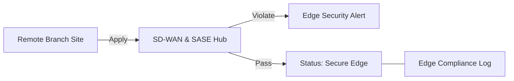

### 6. Hybrid Data Plane & Traffic Engineering Flow
Managing the lifecycle of a traffic request, automatically enforcing institutional traffic policies and bandwidth guarantees for critical workloads, ensuring zero-latency operational confidence.

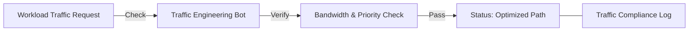

### 7. Institutional Hybrid Maturity Scorecard
Grading organizational performance based on key indicators: Latency/Redundancy Grade, Security Coverage, and Automation Maturity Index.

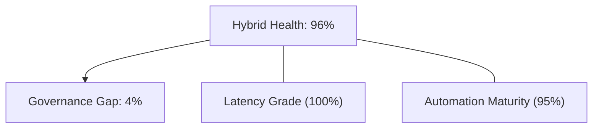

### 8. Identity & RBAC for Hybrid Governance
Managing fine-grained access to landing zone hubs, connectivity workers, and audit logs between Network Architects, Hybrid Cloud Engineers, and Security Policy Owners.

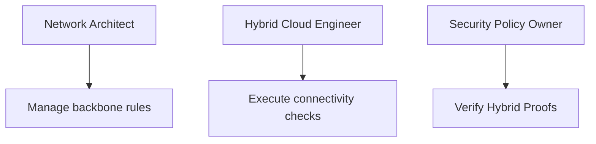

### 9. IaC Deployment: Hybrid-Landing-Zone-as-Code Framework
Using modular Terraform to deploy and manage the versioned distribution of the connectivity tracking hubs, traffic engineering workers, and forensic metadata lakes.

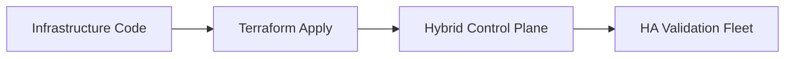

### 10. AIOps Hybrid Drift & Performance Validation Flow
Using advanced analytics to identify sudden surges in latency, packet loss, suspicious configuration drifts, or unusual traffic pattern changes that could result in institutional risk.

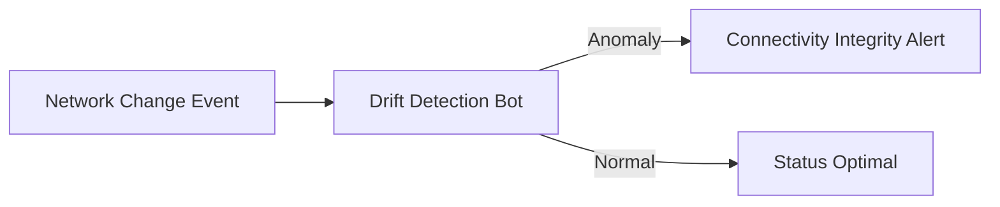

### 11. Metadata Lake for Forensic Hybrid Audit
Storing long-term records of every connectivity provisioned, every route change recorded, and every VPN/DirectConnect event for institutional record-keeping, compliance auditing, and post-provisioning forensics.

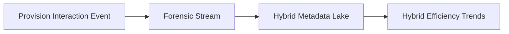

---

## 🏛️ Core Governance Pillars

1.  **Unified Foundation Coordination**: Maximizing resilience by centralizing all hybrid measurement through a single institutional plane.
2.  **Automated Transit Provisioning**: Eliminating "manual circuit" scenarios through proactive orchestration and pattern verification.
3.  **Sequential Performance Intelligence**: Ensuring zero-interruption operations through dependency-aware multi-cloud traffic engineering.
4.  **Zero-Trust Hybrid Protection**: Automatically enforcing identity-based access and rule evaluation across all hybrid tiers.
5.  **Autonomous Operations Logic**: Guaranteeing reliability through automated industry-specific hybrid monitoring runbooks.
6.  **Full Hybrid Auditability**: Immutable recording of every route change and connectivity provision for institutional forensics.

---

## 🛠️ Technical Stack & Implementation

### Connectivity Engine & APIs
*   **Framework**: Python 3.11+ / FastAPI.
*   **Transit Engine**: Custom Python-based logic for multi-cloud network provisioning and DORA-style connectivity metrics.
*   **Integrations**: Native connectors for AWS Direct Connect, Azure ExpressRoute, GCP Interconnect, and SD-WAN APIs.
*   **Persistence**: PostgreSQL (Connectivity Ledger) and Redis (Live Hybrid State).
*   **Auth Orchestrator**: Federated OIDC/SAML for least-privilege network management access.

### Governance Dashboard (UI)
*   **Framework**: React 18 / Vite.
*   **Theme**: Dark, Blue, Slate (Modern high-fidelity connectivity aesthetic).
*   **Visualization**: D3.js for network topologies and Recharts for performance velocity analytics.

### Infrastructure & DevOps
*   **Runtime**: AWS EKS or Azure Kubernetes Service (AKS) for management plane.
*   **Hybrid Hub**: Managed event sourcing for immutable hybrid security timeline reconstruction.
*   **IaC**: Modular Terraform for deploying the hybrid landing zone and validation fleet.

---

## 🏗️ IaC Mapping (Module Structure)

| Module | Purpose | Real Services |
| :--- | :--- | :--- |
| **`infrastructure/conn_hub`** | Central management plane | EKS, PostgreSQL, Redis |
| **`infrastructure/gateways`** | Distributed transit provisioners | K8s Workers, Cloud APIs |
| **`infrastructure/connectors`** | Hybrid Circuit Ingestion Hubs | Webhooks, Lambda |
| **`infrastructure/auditing`** | Forensic hybrid sinks | S3, Athena, Quicksight |

---

## 🚀 Deployment Guide

### Local Principal Environment
```bash
# Clone the landing zone platform
git clone https://github.com/devopstrio/hybrid-landingzone.git
cd hybrid-landingzone

# Configure environment
cp .env.example .env

# Launch the Hybrid stack
make init

# Trigger a mock transit provisioning and automated performance validation simulation
make simulate-hybrid
```

Access the Management Portal at `http://localhost:3000`.

---

## 📜 License
Distributed under the MIT License. See `LICENSE` for more information.

---
<div align="center">
  <p>© 2026 Devopstrio. All rights reserved.</p>
</div>
