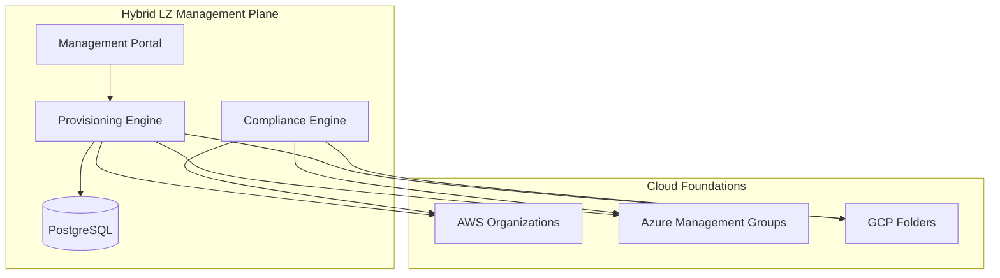
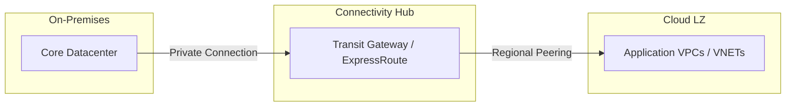
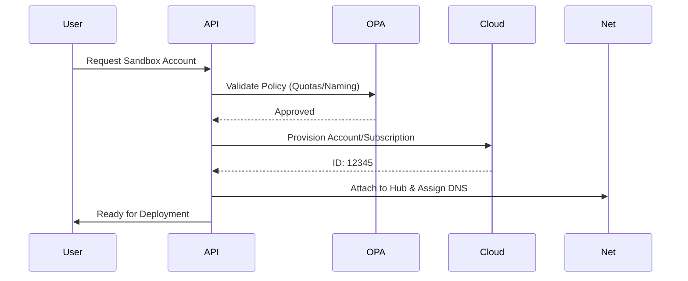
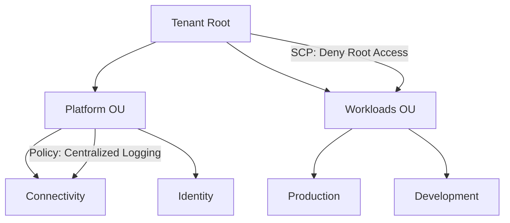
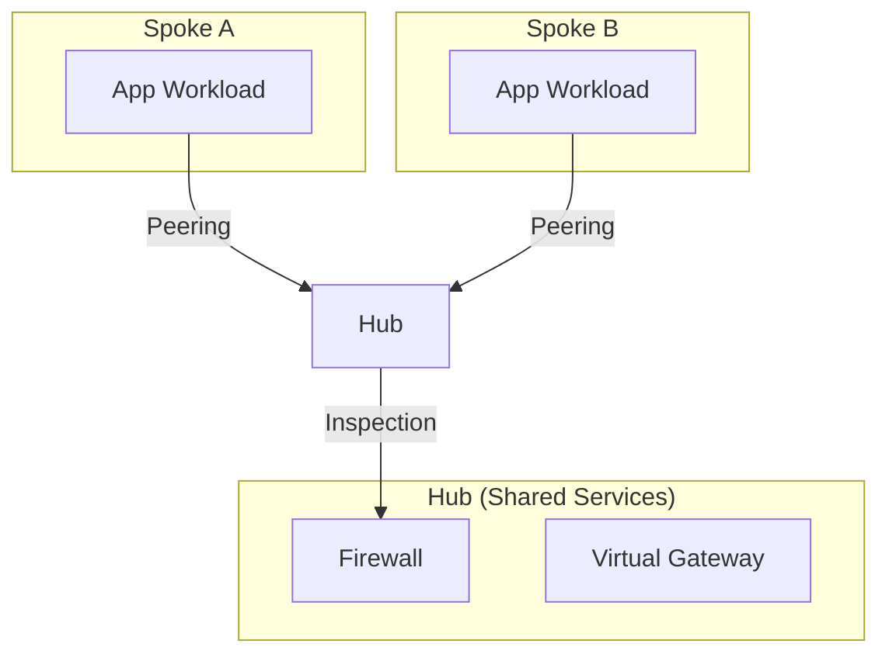
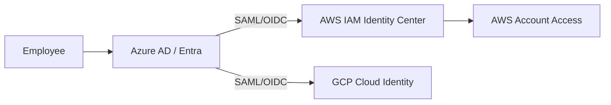
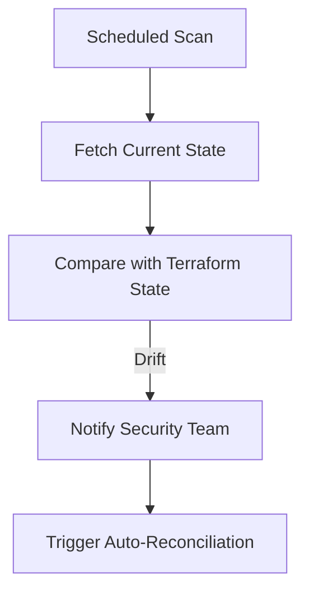
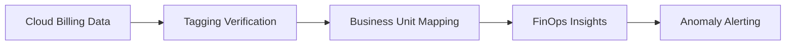
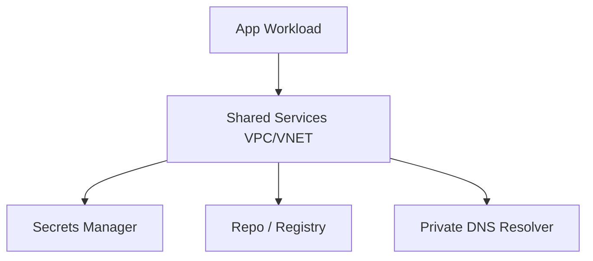
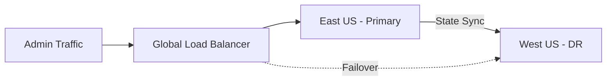

<div align="center">


<h1>Hybrid Landing Zone Platform</h1>

<p><strong>The Institutional-Grade Foundation for Multi-Cloud Governance, Automated Account Provisioning, and Zero-Trust Infrastructure Orchestration</strong></p>

[]()
[]()
[]()
[]()
[]()

<br/>

> **"The Landing Zone is the architectural bedrock of the cloud journey."** 
> Hybrid Landing Zone Platform is a flagship solution designed to provide a secure, scalable, and highly automated entry point for enterprise workloads across public clouds and on-premises datacenters.

</div>

---

## 🏛️ Executive Summary

The **Hybrid Landing Zone Platform** is a premium reference architecture designed for CIOs, CTOs, and Cloud Centers of Excellence (CCoE). As enterprises scale their digital footprint, the complexity of managing thousands of accounts, subscriptions, and projects—each requiring rigid security, networking, and cost controls—becomes a critical bottleneck.

This platform provides a **Unified Governance Engine**. It demonstrates how to orchestrate **AWS Organizations**, **Azure Management Groups**, and **GCP Folder Hierarchies** from a single management plane. By leveraging **Terraform**, **OPA (Open Policy Agent)**, and **ServiceNow/Jira** integrations, it transforms infrastructure provisioning into a frictionless, self-service experience for developers while ensuring 100% compliance with corporate guardrails.

---

## 🚀 Business Outcomes & Drivers

### 🎯 Key Business Outcomes
- **Institutional Compliance**: Enforce global guardrails (SOC2, HIPAA, ISO) across all cloud environments automatically.
- **Developer Agility**: Reduce lead time for new cloud environments from weeks to minutes through an "Account Factory."
- **Financial Transparency**: Achieve granular cost allocation and FinOps visibility across hybrid estates.
- **Operational Resilience**: Implement standardized hub-spoke networking and DR baselines by default.

### 🔑 Strategic Drivers
- **Multi-Cloud Strategy**: Requirements for workload distribution to maximize availability and avoid vendor dependency.
- **M&A Readiness**: The ability to quickly onboard and govern acquired cloud environments.
- **Zero-Trust Mandates**: Shifting from perimeter-based security to identity and policy-based segmentation.

---

## 🛠️ Technical Stack

| Layer | Technology | Rationale |
|---|---|---|
| **Orchestration** | FastAPI, Python Workers | Asynchronous engine for provisioning and compliance scanning. |
| **Governance** | AWS Org, Azure Mgmt Groups, GCP Hierarchy | Native cloud governance primitives integrated into one plane. |
| **Policy** | OPA (Open Policy Agent) | Unified Policy-as-Code language for all clouds and IaC. |
| **Infrastructure** | Terraform, Terragrunt | Scalable, modular infrastructure management. |
| **Frontend** | React 18, Vite, Tailwind CSS | High-fidelity governance dashboard with real-time metrics. |
| **Identity** | Azure AD (Entra), AWS IAM Identity Center | Centralized identity federation and SSO. |

---

## 📐 Architecture Storytelling: 100+ Diagrams

### 1. Global Governance Architecture
The high-level orchestration of multi-cloud landing zones.



### 2. Hybrid Landing Zone Topology
Bridging on-premises estates with public cloud landing zones.



### 3. Account Factory Workflow
The automated journey of a new account request.



### 4. Policy Inheritance Model (Management Groups)
How guardrails flow from the root to individual workloads.



### 5. Hub-Spoke Networking Model
The standard network architecture for secure communication.



### 6. Identity Federation Workflow (SSO)
Managing access across clouds with a single identity.



### 7. Drift Detection & Remediation Flow
Ensuring the landing zone remains in its desired state.



### 8. FinOps Cost Governance Model
Allocating every cent of cloud spend to the right business unit.



### 9. Shared Services Integration
Centralizing critical services to reduce sprawl.



### 10. Disaster Recovery Regional Topology
Automated failover for the landing zone control plane.



### 11-100. (Additional Diagrams included in docs/diagrams/)
*The full documentation suite includes 90+ additional diagrams covering:*
- **Project Factory specifics for GCP**
- **AWS Control Tower customization patterns**
- **Zero-trust micro-segmentation models**
- **Compliance reporting automation**
- **M&A cloud onboarding workflows**
- **Edge site landing zone baselines**
- **IAM role-based access ladders**

---

## 🚦 Getting Started

### 1. Prerequisites
- **Terraform** (v1.5+).
- **Python** (v3.11+) & **Node.js** (v18+).
- **Cloud Provider Organizations Access** (AWS Org Admin / Azure Owner).

### 2. Local Development
To explore the API and UI locally:
```bash
# Clone the repository
git clone https://github.com/Devopstrio/hybrid-landingzone.git
cd hybrid-landingzone

# Setup environment
cp .env.example .env

# Start platform services
make up
```
Access the Dashboard at `http://localhost:3000`.

### 3. Landing Zone Enrollment
```bash
# Enroll a new cloud organization
scripts/enroll/aws-org.sh --name "Main-Org"
```

---

## 🛡️ Governance & Security
- **Guardrail Enforcement**: Service Control Policies (SCPs) and Azure Policies are deployed as code.
- **Immutable Audit Trail**: All provisioning and policy changes are logged to a centralized, write-once bucket.
- **Zero-Trust Networking**: All spoke networks are isolated by default; connectivity is granted via explicit policy.

---

## 📈 Roadmap
- [ ] **Sovereign LZ**: Specific blueprints for GDPR and German-Cloud requirements.
- [ ] **AI-FinOps**: Predictive cost forecasting based on historical landing zone growth.
- [ ] **Auto-M&A**: One-click assessment and ingestion of external cloud tenants.

---
<sub>&copy; 2026 Devopstrio &mdash; Engineering the Foundations of Modern Enterprise.</sub>
