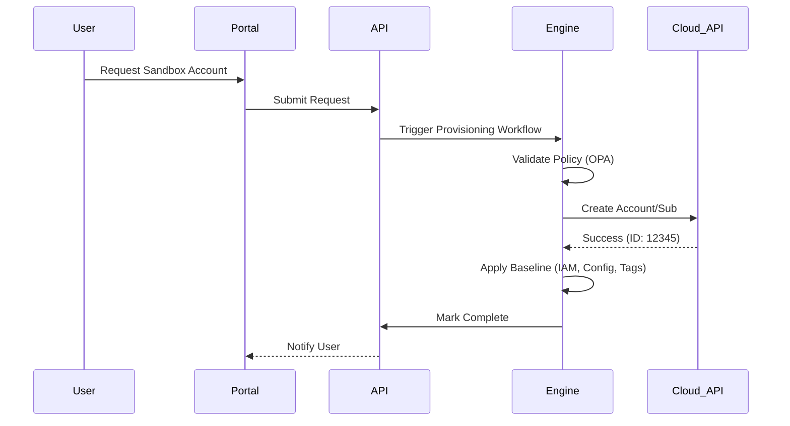
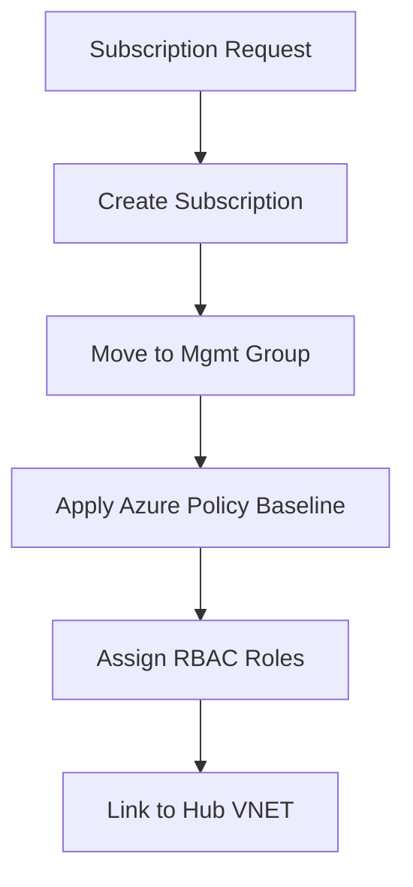
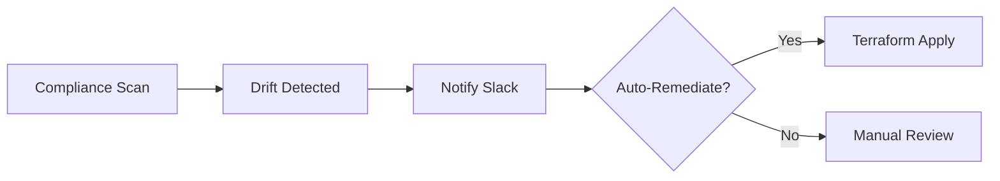

# Cloud Governance Diagrams

## 14. Account Vending Flow
*The end-to-end process of provisioning a new cloud account.*

```mermaid
sequenceDiagram
    participant User
    participant Portal
    participant API
    participant Engine
    participant Cloud_API

    User->>Portal: Request Sandbox Account
    Portal->>API: Submit Request
    API->>Engine: Trigger Provisioning Workflow
    Engine->>Engine: Validate Policy (OPA)
    Engine->>Cloud_API: Create Account/Sub
    Cloud_API-->>Engine: Success (ID: 12345)
    Engine->>Engine: Apply Baseline (IAM, Config, Tags)
    Engine->>API: Mark Complete
    API-->>Portal: Notify User
```

## 15. Subscription Factory Flow

```mermaid
graph TD
    Req[Subscription Request] --> Sub[Create Subscription]
    Sub --> MG[Move to Mgmt Group]
    MG --> Baseline[Apply Azure Policy Baseline]
    Baseline --> Roles[Assign RBAC Roles]
    Roles --> Connectivity[Link to Hub VNET]
```

## 19. Drift Remediation Flow

```mermaid
graph LR
    Scan[Compliance Scan] --> Detect[Drift Detected]
    Detect --> Alert[Notify Slack]
    Alert --> Remediate{Auto-Remediate?}
    Remediate -- "Yes" --> TF[Terraform Apply]
    Remediate -- "No" --> Manual[Manual Review]
```
