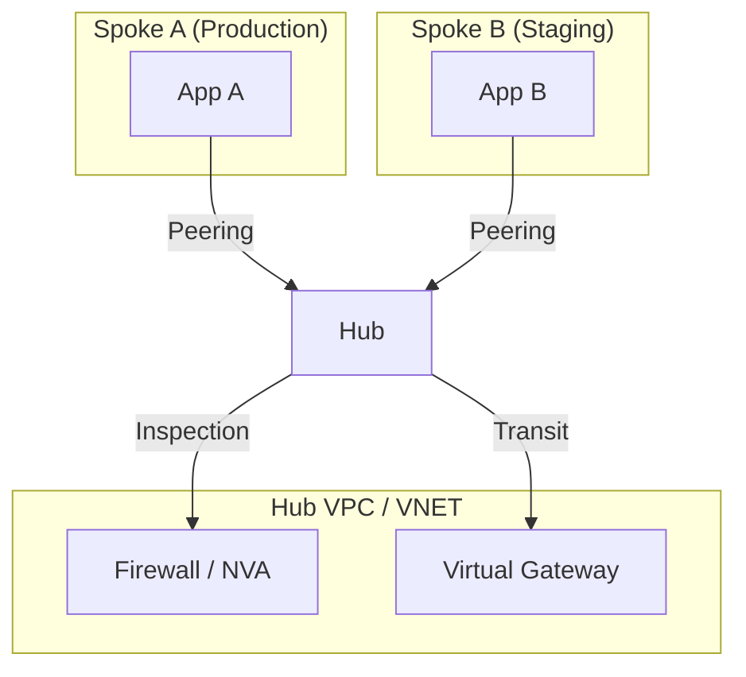
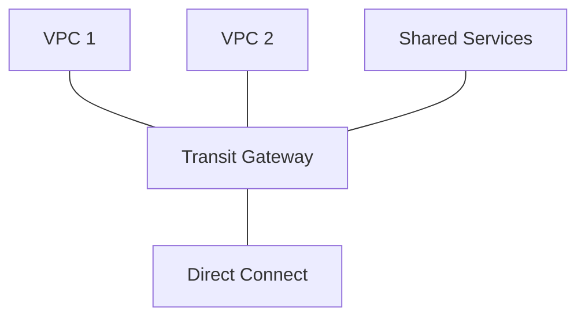
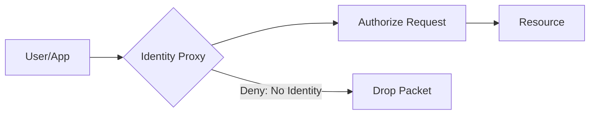

# Networking Diagrams

## 21. Hub-Spoke Topology
*Standard network architecture for landing zones.*

```mermaid
graph TD
    subgraph "Hub VPC / VNET"
        FW[Firewall / NVA]
        GW[Virtual Gateway]
    end

    subgraph "Spoke A (Production)"
        AppA[App A]
    end

    subgraph "Spoke B (Staging)"
        AppB[App B]
    end

    AppA -- "Peering" --> Hub
    AppB -- "Peering" --> Hub
    Hub -- "Inspection" --> FW
    Hub -- "Transit" --> GW
```

## 22. Transit Gateway Model

```mermaid
graph TD
    TGW[Transit Gateway]
    VPC1[VPC 1]
    VPC2[VPC 2]
    VPC3[Shared Services]
    DX[Direct Connect]

    VPC1 --- TGW
    VPC2 --- TGW
    VPC3 --- TGW
    TGW --- DX
```

## 30. Zero Trust Network Flow

```mermaid
graph LR
    User[User/App] --> Identity{Identity Proxy}
    Identity --> AuthZ[Authorize Request]
    AuthZ --> Resource[Resource]
    Identity -- "Deny: No Identity" --> Drop[Drop Packet]
```
